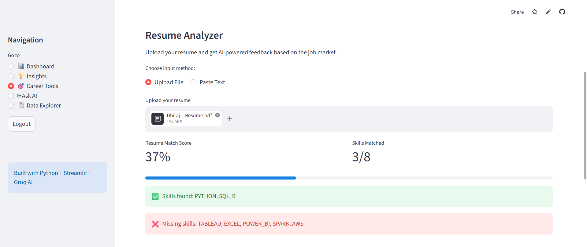
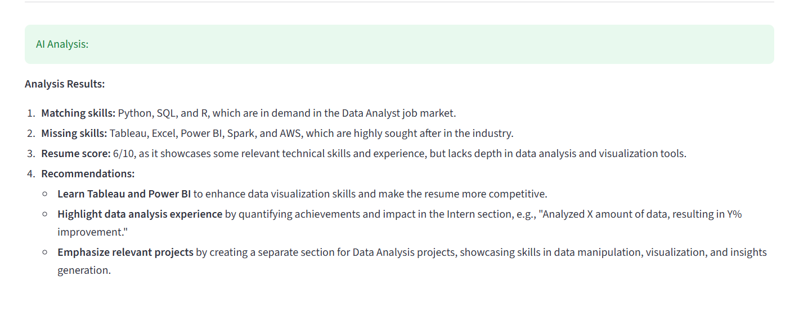

# AI-Powered Job Market Intelligence Dashboard

A professional data analytics web application that analyzes 61,953 real Data Analyst job postings and provides AI-powered career insights, business intelligence, and resume analysis.

## Live Demo
🚀 [View Live App](https://job-market-dashboard-hxcvepmuehm7jq3l76kgrs.streamlit.app)

## Screenshots
### Dashboard


### Resume Analyzer



## Features
- 🔐 **User Authentication** — Secure login and signup system
- 📊 **Interactive Dashboard** — Charts for top job titles, locations, salaries and in-demand skills
- 💡 **Business Insights** — Auto-calculated insights like salary comparisons, remote vs onsite pay, skill demand percentages
- 🎯 **Job Match Score** — Enter your skills and see how well you match the job market with real data-backed recommendations
- 📈 **Skill Gap Impact** — Shows exactly how much each missing skill increases your salary potential
- 📄 **Resume Analyzer** — Upload your resume (PDF) and get AI-powered feedback with match percentage and skill gap analysis
- 🤖 **Ask AI** — Ask any question about the job market and get answers based on real data
- 📋 **Data Explorer** — Search and browse all job postings with filters

## Business Insights Generated
- Python + SQL roles pay significantly above average salary
- Remote vs onsite salary comparison from real data
- Top 5 most in-demand skills with exact percentages
- Average salary breakdown by individual skill
- Top hiring companies and locations

## Tech Stack
- **Python** — Core programming language
- **Pandas** — Data loading, cleaning and analysis
- **Streamlit** — Web application framework
- **Plotly** — Interactive data visualizations
- **Groq AI (LLaMA 3.3)** — AI-powered insights and resume analysis
- **SQLite** — User authentication database
- **bcrypt** — Password hashing and security
- **PyPDF2** — PDF resume parsing
- **Git & GitHub** — Version control

## Dataset
- Source: [Kaggle — Data Analyst Job Postings](https://www.kaggle.com/datasets/lukebarousse/data-analyst-job-postings-google-search)
- 61,953 real job postings from Google Search
- 27 columns including title, company, location, salary, skills

## Architecture
User uploads resume / enters skills
↓
Python (Pandas) analyzes against 61,953 job postings
↓
Real data insights calculated (salary, skill demand %)
↓
Groq AI generates personalized recommendations
↓
Streamlit displays interactive dashboard

## Key Data Insights
- SQL is the most in-demand skill across all postings
- Python + SQL combination commands premium salaries
- Remote roles show competitive salary vs onsite
- Top hiring locations concentrated in major US cities

## How to Run Locally
1. Clone the repository
git clone https://github.com/dhirajpawar-dev/job-market-dashboard.git
2. Install dependencies
pip install -r requirements.txt
3. Add your Groq API key in a `.env` file
GROQ_API_KEY=your_key_here
4. Download the dataset from Kaggle and save as `gsearch_jobs_small.csv`
5. Run the app
streamlit run app.py

## Use Cases
- **Job Seekers** — Understand what skills to learn, analyze salary expectations, get resume feedback
- **HR Teams** — Understand market skill demands and salary benchmarks
- **Career Counselors** — Data-driven career guidance backed by real job market data
- **Students** — Plan which skills to learn based on real market demand

## How Insights Are Calculated

All business insights are calculated directly from the 61,953 job postings dataset using Python and Pandas:

**Salary by Skill:**
- Filter all rows where `description_tokens` contains a specific skill (e.g. "python")
- Calculate mean of `salary_yearly` for filtered rows
- Compare against overall mean salary to get percentage difference

**Remote vs Onsite Salary:**
- Filter rows where `work_from_home == True` → calculate mean salary
- Filter rows where `work_from_home == False` → calculate mean salary
- Compare both averages

**Skill Demand Percentage:**
- Count rows where skill appears in `description_tokens`
- Divide by total rows (61,953) × 100
- Example: SQL appears in 72% of all postings

**Job Match Score:**
- User enters their skills
- System checks each skill against top 8 market skills
- Score = (matched skills / total market skills) × 100

## Sample SQL / Pandas Queries Used

```python
# Top 10 most in-demand job titles
df['title'].value_counts().head(10)

# Average salary for Python + SQL roles
df[
    df['description_tokens'].apply(
        lambda x: 'python' in str(x).lower() and 'sql' in str(x).lower()
    ) & df['salary_yearly'].notna()
]['salary_yearly'].mean()

# Remote vs onsite salary comparison
remote_avg = df[df['work_from_home'] == True]['salary_yearly'].mean()
onsite_avg = df[df['work_from_home'] == False]['salary_yearly'].mean()

# Skill demand percentage
skill_count = df['description_tokens'].apply(
    lambda x: 'python' in str(x).lower()
).sum()
demand_pct = (skill_count / len(df)) * 100

# Top hiring locations
df['location'].value_counts().head(10)

# Salary distribution by location
df.groupby('location')['salary_yearly'].mean().sort_values(ascending=False)
```

## Dataset Limitations

- **US-biased data** — All job postings are from Google Search US results. Salary and skill demand may differ significantly in India, Europe or other regions
- **Missing salary data** — Only ~15% of job postings include salary information. Salary insights are based on this subset and may not represent the full market
- **Data freshness** — Dataset was last updated in 2023. Some skill demands and salary figures may have shifted since then
- **Job title inconsistency** — Same roles appear under different titles (Data Analyst, Business Analyst, Analytics Engineer) which may affect aggregations
- **Skill detection method** — Skills are detected by keyword matching in job descriptions. This may miss variations (e.g. "MS Excel" vs "Excel") leading to slight undercounting

## Author
**Dhiraj Pawar**
- GitHub: [@dhirajpawar-dev](https://github.com/dhirajpawar-dev)
- Live App: [Job Market Dashboard](https://job-market-dashboard-hxcvepmuehm7jq3l76kgrs.streamlit.app)